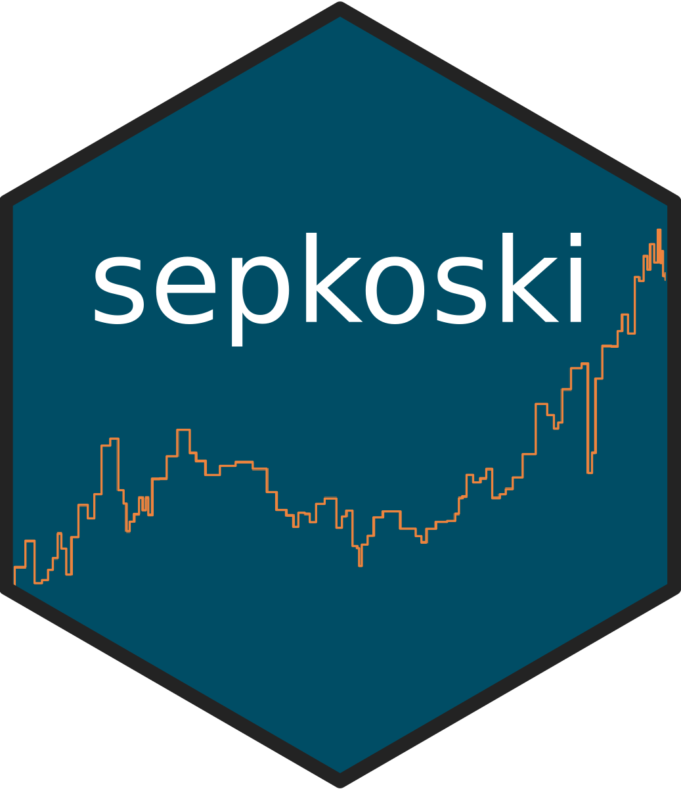
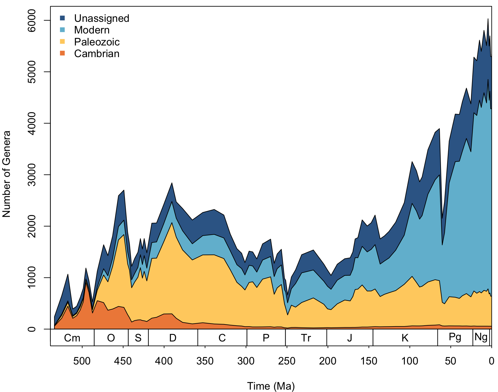

# sepkoski 

<!-- badges: start -->
[](https://github.com/LewisAJones/sepkoski/actions/workflows/R-CMD-check.yaml)
[](https://app.codecov.io/gh/LewisAJones/sepkoski?branch=main)
[](https://zenodo.org/badge/latestdoi/564230284)
[](https://twitter.com/LewisAlanJones)
<!-- badges: end -->

## Overview

`sepkoski` is a data R package of Sepkoski's fossil marine animal genera compendium (Sepkoski, 2002), ported from Shanan Peters' [online database](http://strata.geology.wisc.edu/jack/).

The aim of `sepkoski` is to provide a light and easily-accessible solution to working with Sepkoski's compendium to support teaching exercises. The package provides access to:

- `sepkoski_raw` Sepkoski's raw fossil marine animal genera compendium (Sepkoski, 2002).
- `sepkoski` Sepkoski's compendium with first and last appearance intervals updated to be consistent with stages from the [International Geological Time Scale 2022](https://stratigraphy.org/ICSchart/ChronostratChart2022-02.pdf).
- `interval_table` A table linking intervals in Sepkoski's compendium with the [International Geological Time Scale 2022](https://stratigraphy.org/ICSchart/ChronostratChart2022-02.pdf).
- A function for plotting Sepkoski's evolutionary fauna for easy reproduction in presentations, articles, etc.

Note: In updating interval names, some interpretation was required. The `interval_table` dataset documents the linked interval names. If you notice any issue, or disagree with any of these assignments, please feel free to raise a GitHub issue, and I will do my best to address them as soon as possible.

## Installation

The development version of `sepkoski` can be installed via GitHub using:

```r
# Install development version of the package
devtools::install_github("LewisAJones/sepkoski")
```

## Usage

```r
# Load library
library(sepkoski)
```

The datasets in `sepkoski` can be easily accessed via:

```r
# Raw dataset
data("sepkoski_raw")
# Updated interval dataset
data("sepkoski")
# Interval table
data("interval_table")
```

The only function in the `sepkoski` package at this time is `sepkoski_curve()`. This can be used to plot Sepkoski's evolutionary fauna (Sepkoski, 1981) using the Sepkoski (2002) fossil marine animal genera compendium. Users may provide their own values to function arguments to customise the appearance, or simply use the default arguments:

```r
sepkoski_curve()
```


## References

> Sepkoski, J. J. (1981). A factor analytic description of the Phanerozoic marine fossil record. *Paleobiology*, 7(1), pp. 36-53.

> Sepkoski, J. J. (2002). A compendium of fossil marine animal genera. *Bulletins of American paleontology*, 363, pp. 1-560.

> Peters, S. (2022). [Sepkoski's Online Genus Database](http://strata.geology.wisc.edu/jack/). 

