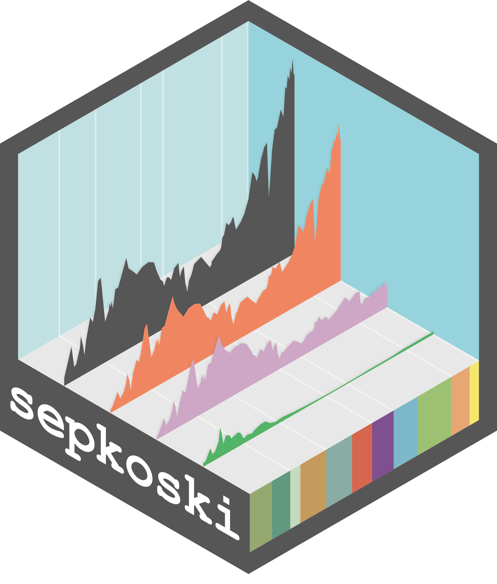

# sepkoski 

<!-- badges: start -->
[](https://github.com/LewisAJones/sepkoski/actions/workflows/R-CMD-check.yaml)
<!-- badges: end -->

`sepkoski` is a data R package of Sepkoski's fossil marine animal genera compendium (Sepkoski, 2002).

The aim of `sepkoski` is to provide a light and easily-accessible solution to Sepkoski's compendium to support teaching exercises. The package provides access to:

- Sepkoski's raw fossil marine animal genera compendium
- A processed compendium with first and last appearance intervals updated to be consistent with the stages from the International Geological Time Scale 2022
- An interval table which documents the linked intervals in Sepkoski's fossil marine animal genera compendium with the International Geological Time Scale 2022. If you notice any issue or disagree with any of these assignments, please feel free to raise a GitHub issue, and I will do my best to address any issues ASAP.
- A function for plotting Sepkoski's evolutionary fauna for easy reproduction in presentations, articles, etc.

# Installation

The development version of `sepkoski` can be installed via GitHub using:

```r
# install.packages("sepkoski")
devtools::install_github("LewisAJones/sepkoski")
```
